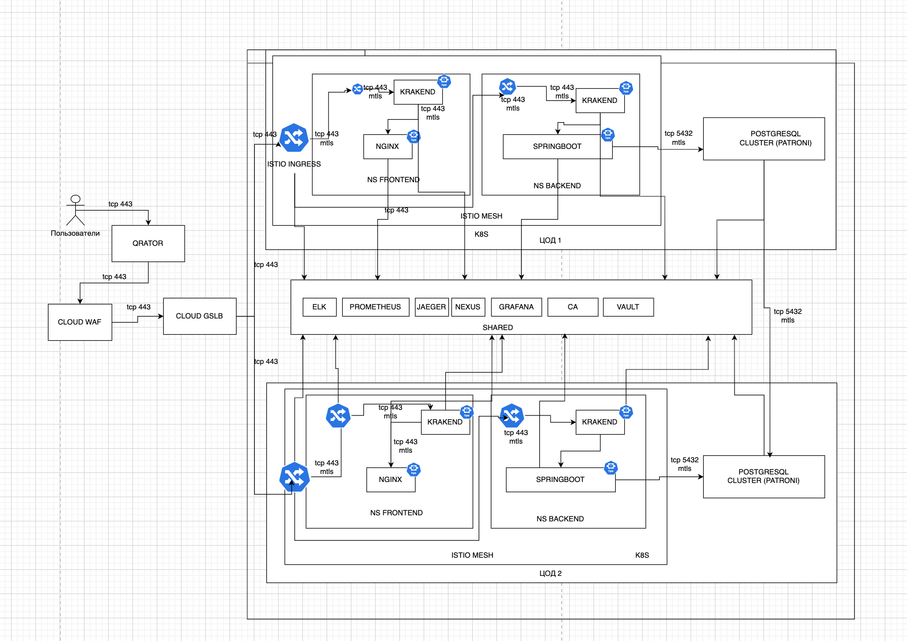
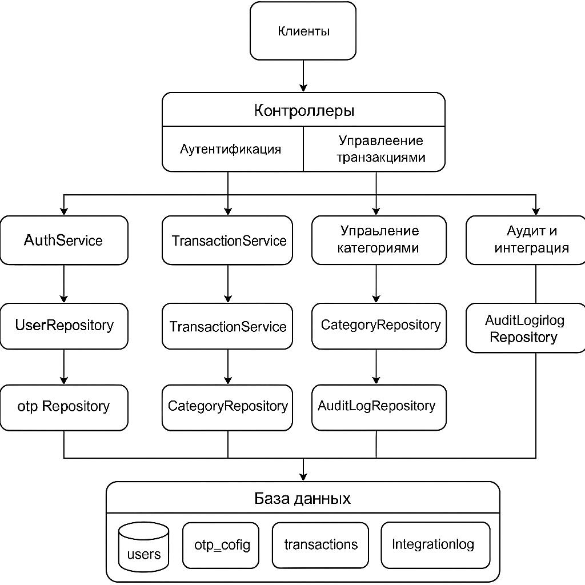

# 🏗️ Архитектура Financial Monitoring

## 📊 Общая информация

Многоуровневое приложение финансового мониторинга на базе Spring Boot.

## ⚙️ Технологический стек

| Компонент     | Используется                                 |
|---------------|----------------------------------------------|
| Язык          | Java 21                                      |
| Фреймворк     | Spring Boot                                  |
| Безопасность  | Spring Security, JWT, BCrypt                 |
| БД            | PostgreSQL 17                                |
| ORM           | JDBC                                         |
| Документация  | OpenAPI 3.0 ([api-docs.json](api-docs.json)) |
| Контейнеры    | Docker                                       |
| CI/CD         | GitHub Actions / GitLab CI                   |
| Оркестрация   | Kubernetes (k8s)                             |
| Gateway       | Krakend API Gateway                          |
| Мониторинг    | Prometheus, Grafana, Jaeger                  |

---

## 🌐 Архитектурные уровни

### 1. 👥 Клиенты
- Web
- Мобильные приложения
- Инструменты тестирования (Postman, curl, locust)
- Все обращения идут через API Gateway

### 2. 🧭 API Gateway: Krakend
- Проверка JWT-токенов
- Проверка схем запросов и ответов
- Роутинг, агрегация, кэширование , мутация запросов
- Входная точка в k8s-кластер

### 3. 🎯 REST API (Spring Boot)

#### Основные контроллеры (согласно OpenAPI):
- `/auth/sign/in` — вход пользователя
- `/auth/sign/up` — регистрация
- `/auth/password/change` — смена пароля
- `/user/edit` — изменение имени
- `/transaction/add` — добавление транзакции
- `/transaction/{id}/edit` — редактирование
- `/transaction/{id}/status` — смена статуса
- `/transaction/{id}/delete` — удаление
- `/transaction/search` — фильтрация транзакций
- `/transaction/export` — экспорт в Excel
- `/category/add` — добавление категории
- `/category/{id}/edit` — редактирование
- `/category/all` — список категорий

### 4. ⚙️ Сервисный слой
- Бизнес-логика, валидация, авторизация
- DTO ↔ Entity, работа с репозиториями

### 5. 💾 Репозитории (JDBC)
- `UserRepository`, `OtpRepository`
- `TransactionRepository`, `CategoryRepository`
- `AuditLogRepository`, `IntegrationLogRepository`

### 6. 🗄️ База данных PostgreSQL
- Таблицы: `users`, `otp_config`, `transactions`, `categories`, `audit_log`, `integrationlog`

---

## 🔐 Безопасность
- JWT-аутентификация
- Spring Security (`SecurityFilterChain`)
- Пароли — хешируются через BCrypt
- Доступ к данным — только владельцам (через userId)

---

## 📊 Мониторинг и логирование
- `/actuator/prometheus` → Prometheus
- Grafana отображает метрики:
  - Ошибки (418, 400 и т.д.)
  - Задержки, RPS
- Аудит действий в `audit_log`
- Логи интеграций в `integrationlog`

---

## 🚀 CI/CD и Docker
- Dockerfile → сборка образа
- GitHub Actions / GitLab CI:
  - Build + test + push → Registry
- Автодеплой в кластер (Helm)

---

## ☸️ Kubernetes (k8s)
- Все сервисы в Pod'ах:
  - `krakend`, `backend`, `postgres`, `pgadmin`, `prometheus`, `grafana`
- Хранение конфигураций: `Secrets`, `ConfigMap`
- Ingress-контроллер (HTTPS)

---

## 🔄 Поток данных (обновлённый)

```text
[Client]
   ↓
[Krakend Gateway]
   ↓ REST
[Spring Boot API]
   ↓
[Services / Repositories]
   ↓
[PostgreSQL]
   ↓
[Audit / Integration logs]
```

Мониторинг:
```
Spring Boot → Prometheus → Grafana
```

CI/CD:
```
Git push → GitHub Actions → Docker Registry → K8s Deploy
```

---

## 📈 Возможности масштабирования
- Горизонтальное масштабирование API и Gateway
- Репликация БД (read-only реплики)
- Отделение логики логирования в микросервисы
- Возможность перейти к использованию брокеров( Kafka/RabbitMQ) при увеличении нагрузки

---

## 🗺️ Диаграмма архитектуры

Архитектура



---
